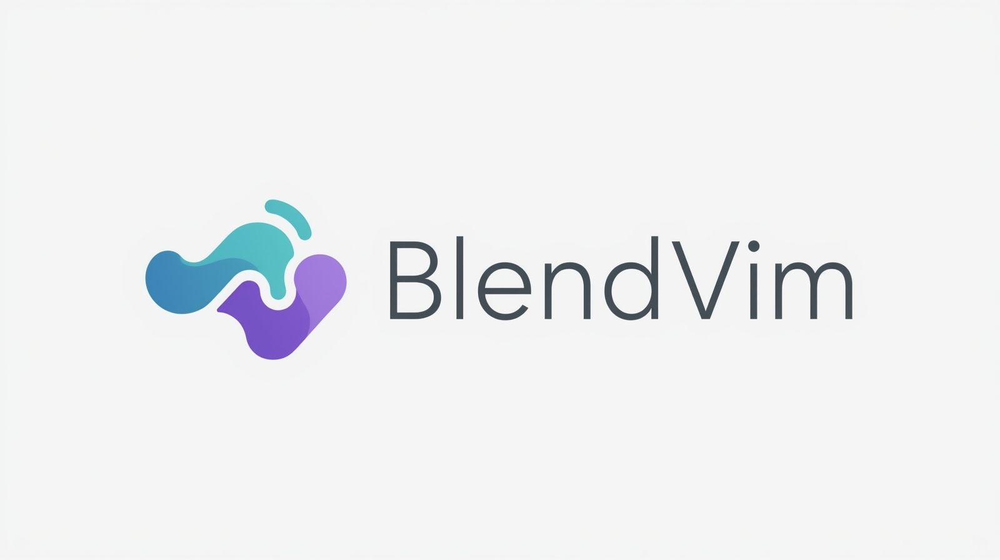
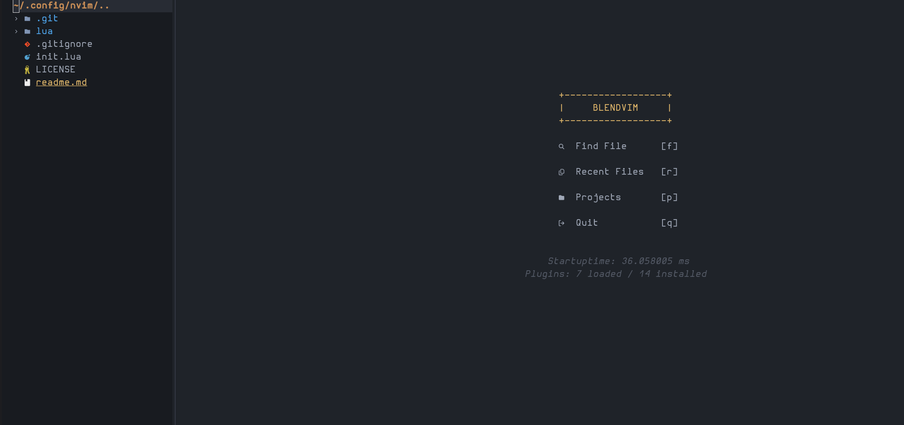

# 🌿 BlendVim



**BlendVim** is a basic Neovim setup designed to get you started quickly with a clean and minimal environment.  
It provides essential features out of the box while allowing easy customization and extension.



---
## 🚀 Installation

##### 1️⃣ Prerequisites

Before installing BlendVim, make sure you have:

- **Neovim** ≥ 0.9.0
- **Git** → to clone the repository
- **Nerd Font** → for proper icon rendering (Nerd Fonts Download)
- Optional: `ripgrep` for faster searching with Telescope (recommended but not required)

##### 2️⃣ Install BlendVim

Run the following commands:

```bash
# Backup existing Neovim config
mv ~/.config/nvim ~/.config/nvim.bak

# Clone BlendVim
git clone https://github.com/nvimworks/BlendVim.git ~/.config/nvim
```

##### 3️⃣ Start Neovim

```bash
nvim
```

The plugin manager (**lazy.nvim**) will automatically install all required plugins on first launch.  
Once installation is complete, restart Neovim to apply the configuration.

##### 4️⃣ Updating BlendVim

```bash
cd ~/.config/nvim
git pull
```

---
## 📂 Configuration Structure

- **Full configuration**: `lua/blend/`  
    Modify this directory to adjust BlendVim’s core setup.
- **Custom extensions**: `lua/custom/`  
    Place additional plugins, mappings, and options here to extend BlendVim without modifying core files.
---
## 📦 Installed Extensions

1. [lazy.nvim](https://github.com/folke/lazy.nvim) – Package manager
2. [telescope.nvim](https://github.com/nvim-telescope/telescope.nvim) – File search & live grep
3. [nvim-tree.lua](https://github.com/nvim-tree/nvim-tree.lua) – File explorer
4. [nvim-treesitter](https://github.com/nvim-treesitter/nvim-treesitter) – Syntax highlighting
5. [statusline](https://github.com/sontungexpt/statusline) – Status line
6. [BufferTabs.nvim](https://github.com/tomiis4/BufferTabs.nvim) – Buffer tabs
7. [dashboard-nvim](https://github.com/glepnir/dashboard-nvim) – Dashboard
8. [indent-blankline.nvim](https://github.com/lukas-reineke/indent-blankline.nvim) – Indentation guides
9. [cheatsheet.nvim](https://github.com/sudormrfbin/cheatsheet.nvim) – Cheatsheet popup

> **Note:** No LSP configuration is included to keep the setup simple.

---
## ⌨ Keymaps

All keymaps can be found in:  

`lua/blend/mappings.lua`

---
## 🤝 Contribution

Pull requests are welcome to make the project more efficient.

### Branching Strategy

- **New features**:  
    `feature/<branch-name>` → merge into `development` branch.
    
- **Bug fixes**:  
    `bugfix/<branch-name>` → merge into `development` branch.
    
- **Hotfixes (production fixes)**:  
    `hotfix/<branch-name>` → merge directly into `main` branch.
    

All feature and bugfix branches must be merged into `development` first.  
Monthly releases will be merged from `development` into `main`.  
Hotfix branches must be tested thoroughly before merging into `main`.

---

## 🐛 Issues

If you encounter a bug or have an idea for improvement:
- Open an issue with a clear description, or
- Submit a pull request with a proper title and detailed description.

---

## 📜 License

This project is licensed under the MIT License.
